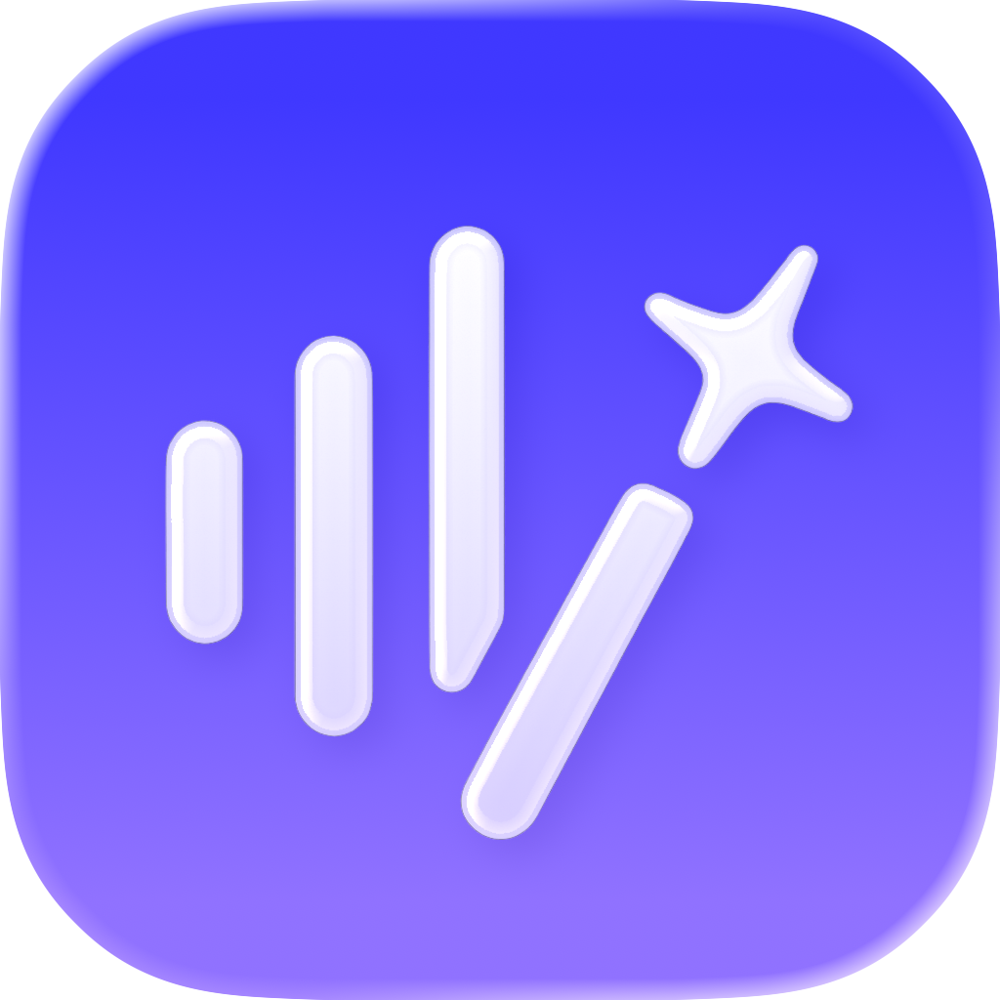
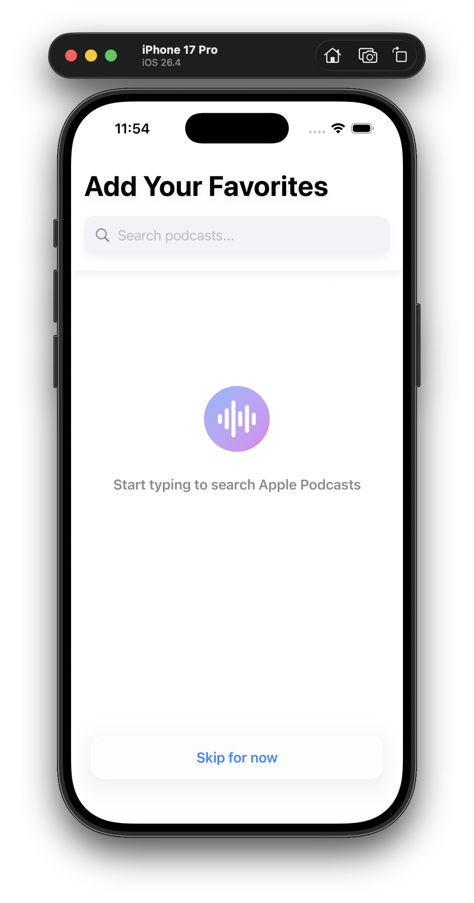
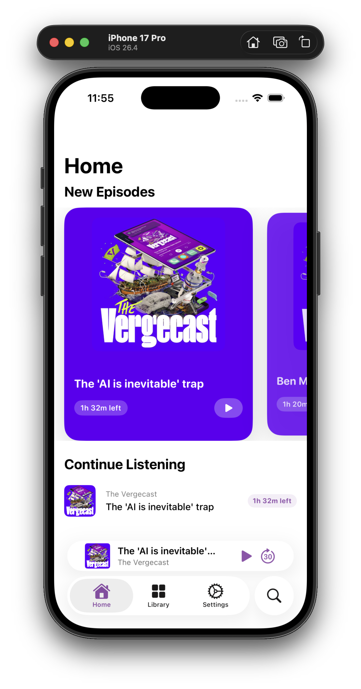
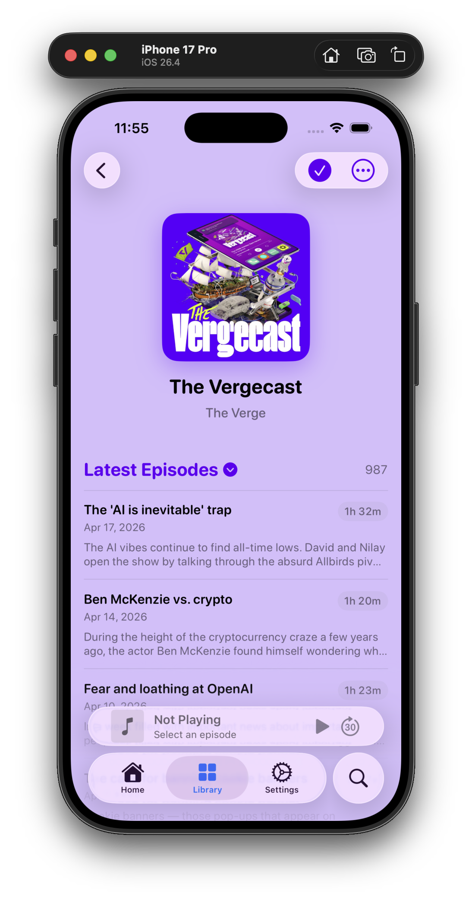
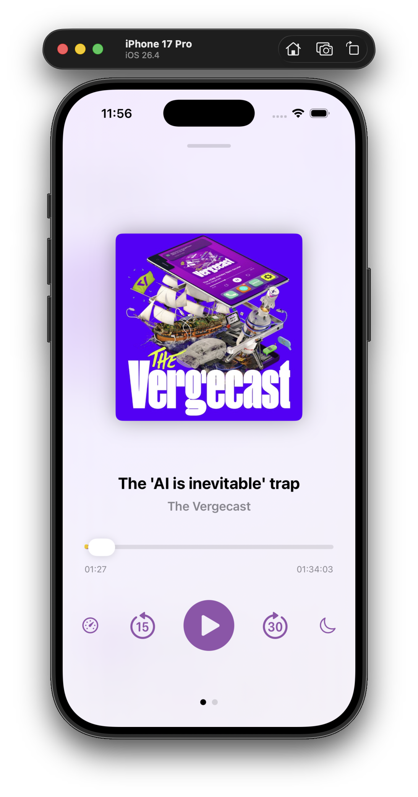
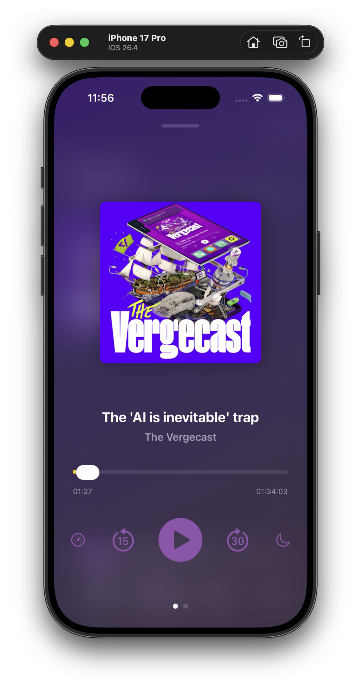
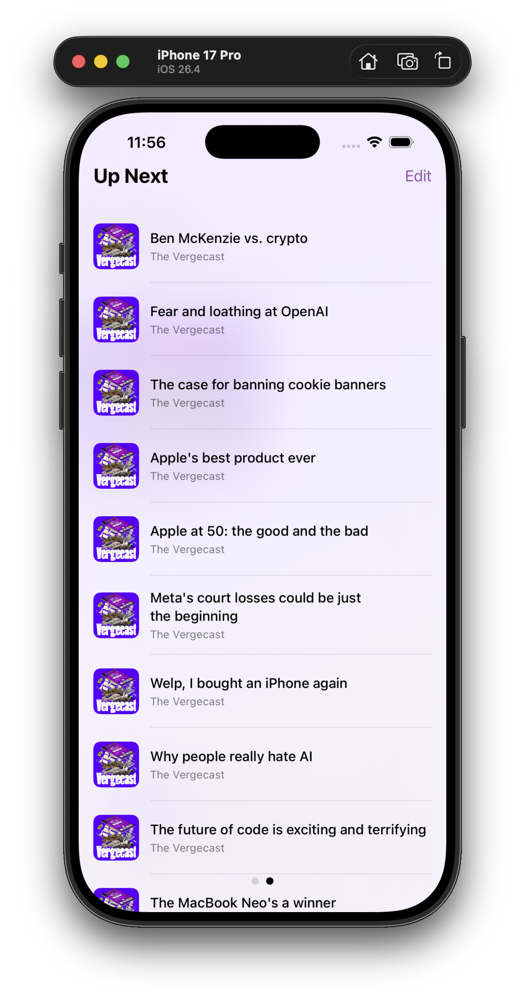
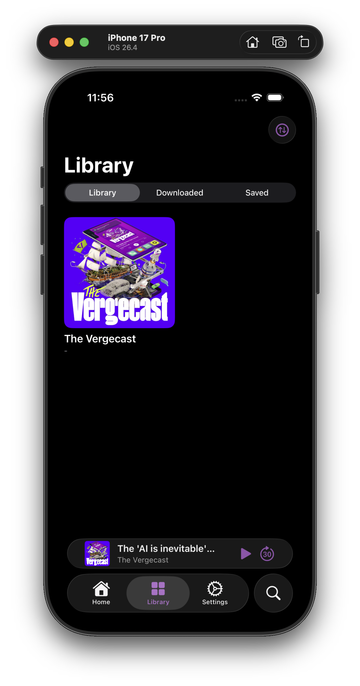
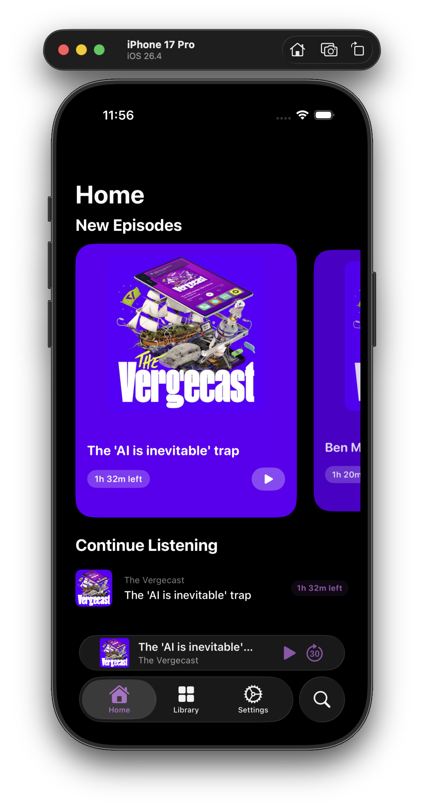
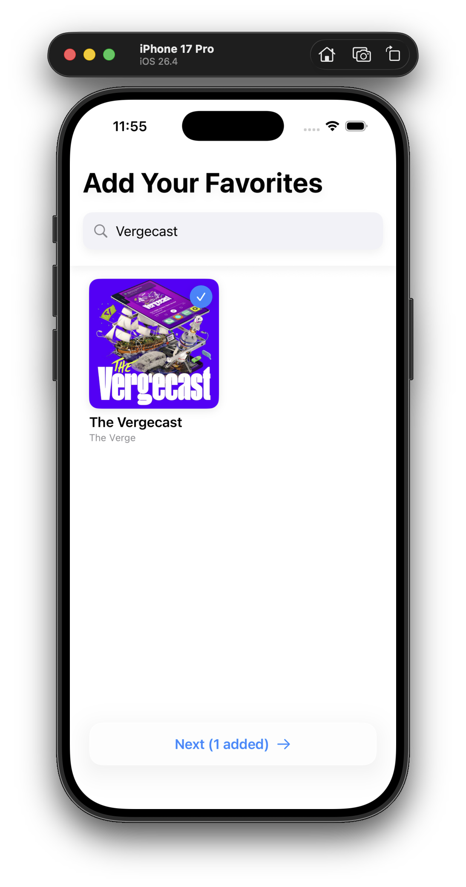

  <picture>
    <source media="(prefers-color-scheme: dark)" srcset="Screenshots/icon.png">
    <source media="(prefers-color-scheme: light)" srcset="Screenshots/icon.png">
    
  </picture>

# CleanCast

**CleanCast** is an iOS podcast app that automatically detects and skips ads using AI-powered transcription and analysis — so you can listen uninterrupted.

## Screenshots

| Onboarding | Home | Podcast |
|:-----------:|:----:|:-------:|
|  |  |  |

| Player (Light) | Player (Dark) | Up Next |
|:--------------:|:-------------:|:-------:|
|  |  |  |

| Library | Home (Dark) | API Setup |
|:-------:|:-----------:|:---------:|
|  |  |  |

## Features

- **AI Ad Detection** — Transcribes episodes with Groq Whisper and uses an LLM to identify ad segments before playback
- **Auto-Skip** — Automatically skips paid sponsorships, self-promo, cross-promotion, and organic product mentions based on your preferences
- **Full-Featured Player** — Mini player, full player with artwork-adaptive colors, scrubbing, and speed control
- **Up Next Queue** — Queue episodes and manage playback order
- **Podcast Library** — Subscribe to podcasts, browse episodes, and search the iTunes catalog
- **Dark & Light Mode** — Fully supports both appearance modes

## How It Works

CleanCast uses a two-stage detection pipeline:

1. **Stage 1 (Coarse)** — The episode audio is transcribed via Groq Whisper. The transcript is split into time-chunked blocks and each block is analyzed by an LLM to flag likely ad segments.
2. **Stage 2 (Refine)** — Flagged segments are refined to find precise start/end timestamps before playback reaches them.

Ad detection runs in the background while you listen, with no interruption to playback.

## Requirements

- iOS 17+
- Xcode 15+
- A [Groq API key](https://console.groq.com) (free tier available)

## Setup

1. Clone the repository
2. Open `CleanCast.xcodeproj` in Xcode
3. Build and run on a simulator or device
4. On first launch, enter your Groq API key in the onboarding screen

> **Note:** CleanCast requires a Groq API key for ad detection. Get one for free at [console.groq.com](https://console.groq.com).

## Tech Stack

- **SwiftUI** — UI framework
- **AVFoundation** — Audio playback
- **Groq Whisper** — Speech-to-text transcription
- **Groq LLaMA 3** — Ad classification
- **iTunes Search API** — Podcast discovery
